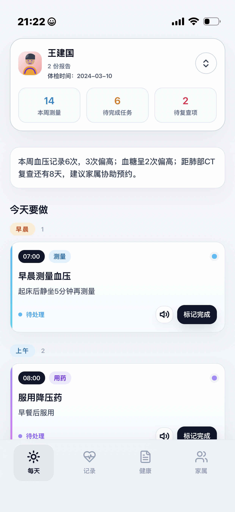
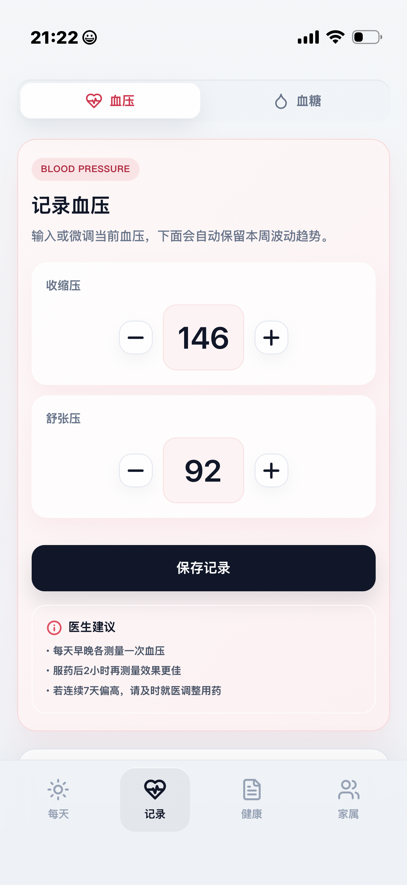
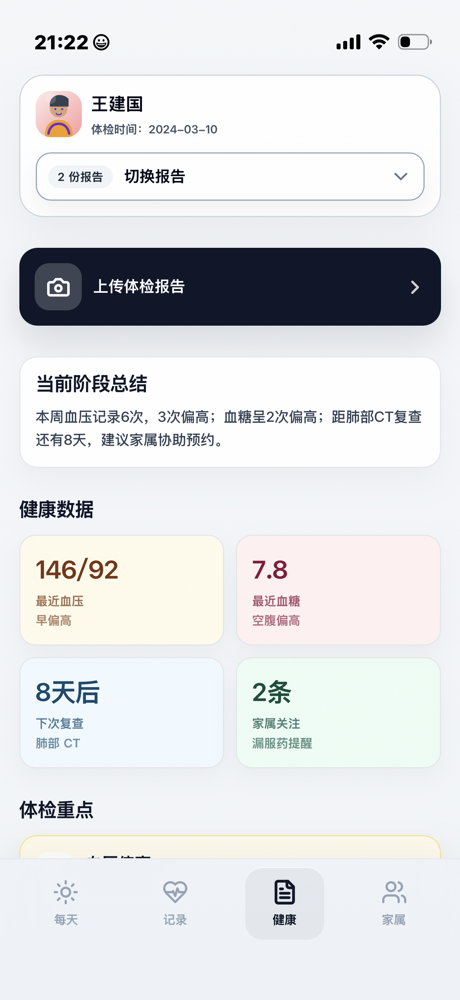
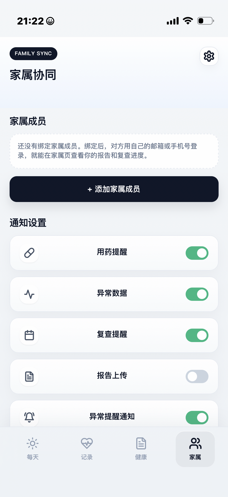

# 健康管家 (Health Guardian)

**面向老年用户的智能体检后健康管理平台**

---

## 项目简介

健康管家是一个专为老年用户设计的智能健康管理平台，通过AI技术自动解析体检报告，提供个性化健康建议，帮助老年人及其家属更好地管理健康状况。

### 核心价值

- **AI智能分析**: 自动识别体检报告，提取关键指标
- **健康监测**: 血压、血糖等日常指标记录与趋势分析
- **用药管理**: 智能提醒，避免漏服
- **家庭协作**: 家属远程关注长辈健康状况
- **适老化设计**: 大字体、简洁界面，易于操作

---

## 产品截图

<p align="center">
  
  
  
  
</p>

---

## 功能特性

### 管理后台
- 用户管理
- 报告审核
- 数据统计分析
- 异常提醒监控

### AI服务
- OCR文字识别（支持中英文）
- PDF文件解析
- 智能健康分析
- 风险评估

---

## 快速开始

### 本地开发

```bash
# 1. 克隆项目
git clone <repository-url>
cd health-guardian

# 2. 配置环境变量
cp .env.example .env
# 编辑.env文件，设置数据库密码和JWT密钥

# 后端 (NestJS)
cd web/api
pnpm install
pnpm start:dev

# 前端 (React)
cd web/admin
pnpm install
pnpm dev

# AI服务 (Python)
cd web/ai-service
pip install -r requirements.txt
python main.py
```

访问地址:
- 管理后台: http://localhost:5173
- API文档: http://localhost:3001/api/docs

---

## 技术栈

- **后端**: NestJS 10.3 + TypeORM + PostgreSQL 15
- **前端**: React 18 + Vite + Zustand + TailwindCSS
- **AI服务**: Python FastAPI + Tesseract OCR

---

## 项目结构

```
health-guardian/
├── web/
│   ├── api/          # NestJS后端API
│   ├── admin/        # React管理后台
│   ├── ai-service/   # Python AI服务
│   └── packages/     # 共享类型/工具
├── LICENSE
└── README.md
```

---

## 许可证

MIT License
